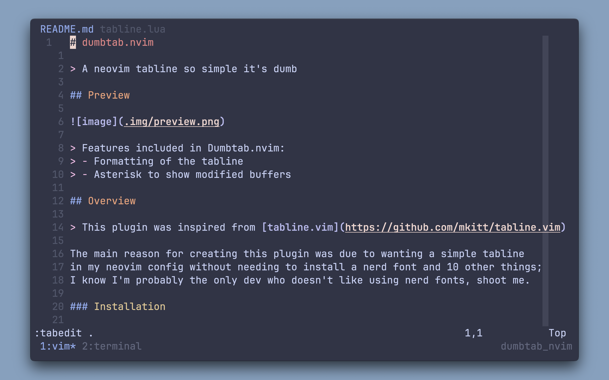

# dumbtab.nvim

> A neovim tabline so simple it's dumb

## Preview



## Overview

> This plugin was inspired from [tabline.vim](https://github.com/mkitt/tabline.vim)

The main reason for creating this plugin was due to wanting a simple tabline
in my neovim config without needing to install a nerd font and 10 other things;
I know I'm probably the only dev who doesn't like using nerd fonts, shoot me. 

### Installation

#### Lazy

```lua
{
    'nathanberry97/dumbtab.nvim'
}
```

#### Packer

```lua
use {
    'nathanberry97/dumbtab.nvim'
}
```

### Setup

> `h dumbtab.nvim`

Once installed you will need to add the following to your config to initialise
the plugin:

```lua
-- Setup dumbtab configuration
require('dumbtab').setup({})
```

> **Note** if you initialise the plugin before you set your theme the colours
> for the tabline will be overwritten 

### Key mappings

In terms of using the functionality of the plugin I have defined one custom
keymapping to create new tabs:

```lua
vim.keymap.set('n', '<leader>t', ':tabedit .<CR>')
```

This results in you being able to press your `leader` key followed by `t` to
create new tabs in neovim.

To switch between your tabs I use the default keymappings provided which are:

- `gt` go to next tab
- `gT` go to previous tab

> To close the tab just use `:q`

### Colours

In terms of customising the colours of the tab line I have provided the following
options when initialising the plugin, the example are the default values which are
set:

```lua
-- Setup dumbtab configuration
require('dumbtab').setup({
    currentTabColour = '13',
    otherTabColour = '8',
})
```

> **Note** you can use hex values too

If you want to see other colours you could set the tabline too please use the
following script:

```shell
#!/bin/bash

for i in {0..255}; do
    printf "\x1b[38;5;${i}mcolour${i}\x1b[0m\n"
done
```
